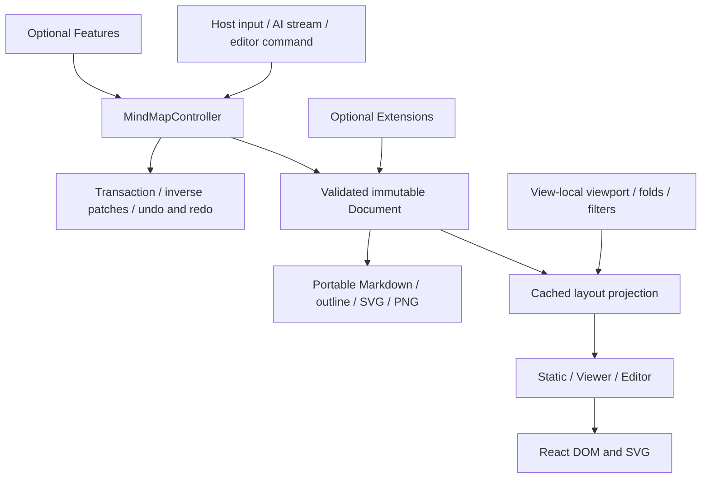

# Open MindMap v0.9.0 refactor requirements and acceptance record

This is the source-backed closure record for the v0.9.0 refactor. It covers the checked-in 0.7.1 baseline, the supplied `Open_MindMap_v0.9.0_Cognitive_Runtime` delta, the integrated source, and the security work discovered during review. Command results are generated separately in [`artifacts/verification.md`](../artifacts/verification.md); that report is authoritative for the exact environment, source fingerprint, timestamps, results, and limitations of the final validation run.

## Outcome and release decisions

- The package version is formally `0.9.0` and the public API is intentionally breaking.
- One TypeScript Document Runtime owns parsing, immutable documents, transactions, history, projection, and subscriptions. The old React/Vite demo runtime and the standalone JavaScript cognitive fallback have been removed.
- The public graph is root, `core`, `static`, `viewer`, `editor`, `features/*`, `extensions/*`, and layered styles. Every JavaScript entry is built as ESM and CJS with declarations.
- Existing product capabilities were migrated: Markdown and JSON input, multiple roots, layout directions, task state, remarks and comments, folding, multiline content, tags, links and images, cross-links, optional LaTeX, search, import/export, history, pointer and keyboard editing, i18n, themes, and AI streaming.
- A successful AI generation creates one undo step. Cancellation and failure roll back. A host replacement invalidates the old stream and late chunks cannot overwrite it.
- The Astro site replaces the legacy Vite shell while faithfully restoring the v0.7.1 page structure. It carries the single-page documentation, shared Playground and Live editor, old hash-route mapping, system light/dark themes, and reduced-motion behavior.
- No Git commit, npm publish, site deployment, or output-size budget gate is part of this work.

## Architecture before and after

Before integration, the repository and supplied delta described competing runtime paths: the 0.7.1 React implementation, a modular TypeScript candidate, and a standalone JavaScript cognitive fallback. They disagreed on document ownership, transactions, streaming, package entries, and styling. The candidate also depended on missing or stale release inputs and carried generated reports that did not validate the current repository.

The integrated architecture has one state and projection path:

The core under `src/components/MindMap/core/` is React-, DOM-, and CSS-free. React lifecycle and controlled input synchronization live under `runtime/`. Features contribute UI through the public controller contract. Extensions contribute parsing, serialization, layout, and export behavior through the public extension contract. The package root aliases the v0.9 editor surface instead of retaining another implementation.

The temporary architecture review requested for the refactor is `/tmp/architecture-review-20260911-173220.html`. It is supporting analysis rather than a package input.

## Source disposition

| Source area from baseline or supplied delta | Final disposition | Evidence |
| --- | --- | --- |
| `src/components/MindMap/core/` | Kept and completed as the headless runtime | Controller, parser, serializer, patch, layout, URL, SVG, limit, and ownership tests live beside the source. |
| `src/components/MindMap/runtime/` | Kept as the only React adapter and surface implementation | Static, Viewer, Editor, commands, culling, projection, theme, messages, portable export, and controller ownership are here. |
| `src/components/MindMap/features/` | Kept as optional entries | History, search, import, export, Markdown editor, and AI use the public feature context/controller. |
| `src/components/MindMap/extensions/` | Kept and completed | Cross-link, dotted-line, folding, frontmatter, LaTeX, multiline, and tags all have package entries. |
| `src/components/MindMap/index.ts` | Restored as the package root | Re-exports the v0.9 Editor contract and shared public API. |
| `src/cognitive-runtime/` and fallback CSS | Removed | No source, build entry, package export, or packed artifact remains. |
| Old `MindMap.tsx`, viewer, components, hooks, plugins, utils, types, and Vite demo | Removed after behavior migration | `verify:boundaries` rejects any retired source root or reference. |
| Legacy `index.html`, `src/App*`, and `src/pages/` Vite shell | Removed after migration | The Astro site owns the active routes; the original `logo.png` and `screenshot.png` are retained under `site/public/`. |
| Supplied `dist/`, site output, logs, screenshots, and verification files | Excluded as implementation input | Library/site output and evidence are rebuilt from the repository source. |
| `site/` | Migrated and reconciled | Astro pages use the real v0.9 runtime, current examples, route aliases, and shared site styles. |

## Original requirement closure

`Closed` means the implementation and focused regression evidence exist in the current source. The separate final verification report must also show current-source passes before the local release gate is considered satisfied.

| ID | Priority | Resolution | Source and regression evidence | Status |
| --- | --- | --- | --- | --- |
| R01 | P0 | Reconciled the 0.7.1 baseline and beta delta into formal 0.9.0 metadata, lock/workspace files, changelog, migration guide, package files, and reproducible source-only builds. | `package.json`, `pnpm-lock.yaml`, `pnpm-workspace.yaml`, `CHANGELOG.md`, `MIGRATION-v0.9.md`; `verify:clean-source`, `verify:pack`. | Closed |
| R02 | P0 | Removed competing runtimes and made the TypeScript controller/document model authoritative for package entries and the site. | `core/controller.ts`, `runtime/useOwnedController.ts`, `entries/*`; `verify:boundaries`. | Closed |
| R03 | P0 | Deleted the syntax-invalid cognitive React fallback, its style, exports, build entry, and references. | `package.json`, `vite.config.ts`, `scripts/verify-boundaries.mjs`; clean build and packed-file allowlist. | Closed |
| R04 | P0 | Routed AI through controller-owned streams and transactions. Success commits once; cancellation, failure, external replacement, and late writes use rollback/invalidation semantics. | `core/controller.ts`, `features/ai-generation.ts`; `ai-generation.test.ts`, `event-phases.test.ts`, runtime integration tests, and AI E2E cases. | Closed |
| R05 | P0 | Added path-copying immutable patches, inverse patches, transaction grouping, animation-frame stream coalescing, bounded caches, and one controller-owned projection cache. | `core/patches.ts`, `controller.ts`, `streaming.ts`, `layout.ts`; `runtime-contract.test.ts`, `projection-cache.test.ts`, `cache-ownership.test.ts`, `benchmark.mjs`. | Closed |
| R06 | P0 | Scoped keyboard handling to the receiving editor surface and kept native controls/editing targets out of editor shortcuts. | `runtime/MindMapEditor.tsx`; runtime tests for two-editor ownership/read-only input and E2E keyboard history. | Closed |
| R07 | P1 | Replaced supplied unknown/zero-capture evidence with source-fingerprinted command recording, benchmark data, browser QA, and screenshot manifests produced from this repository. | `scripts/run-check.mjs`, `source-fingerprint.mjs`, `write-verification-report.py`, `qa-site.mjs`, `capture-site.mjs`; `artifacts/verification.md`. | Closed |
| R08 | P0 | Restricted package exports/build entries to the approved v0.9 graph and layered CSS. | `package.json`, `vite.config.ts`, `build-manifest.mjs`; boundary and packed-consumer checks. | Closed |
| R09 | P0 | Restored the root source entry and aligned ESM, CJS, declaration, and package targets. | `src/components/MindMap/index.ts`, `vite.config.ts`, `tsconfig.lib.json`; library build and `verify:pack` import/require/type consumers. | Closed |
| R10 | P1 | Rewrote active release docs and site copy for formal v0.9 entries and migration from the actual 0.7.1 baseline. | English/Chinese READMEs, changelog, migration guide, docs, Astro pages; site content/link checks. | Closed |
| R11 | P1 | Kept history and streaming policy in the controller; Feature modules render controls and invoke public operations without a second document/history store. | `features/history.tsx`, `features/ai.tsx`, `editor-types.ts`; feature ownership and runtime tests. | Closed |
| R12 | P1 | Implemented all retained extensions, including public frontmatter/cross-link/LaTeX entries and optional KaTeX fallback/export behavior. | `extensions/*`, `entries/extensions/*`; compatibility, serialization, runtime SSR, portable, and optional-peer tests. | Closed |
| R13 | P0 | Preflights public inputs and complete patch batches, rejects malformed batches atomically, and preserves snapshot/history/selection identity on rejection. | `core/utils.ts`, `patches.ts`, `controller.ts`; `mutation-admission.test.ts`, `projection-cache.test.ts`, `security-admission.test.ts`. | Closed |
| R14 | P0 | Added explicit `documentRevision`, controlled-echo tracking, transaction owner generations, external replacement invalidation, and safe controller lifecycle ownership. | `runtime/useOwnedController.ts`, `core/controller.ts`; runtime adapter, stream, replacement, Strict Mode, and stale-result tests. | Closed |
| R15 | P1 | Preserves supplied semantic IDs and reconciles generated IDs by stable content fingerprints instead of path position. | `core/parser.ts`, `utils.ts`; stable-ID, head-insertion, reorder, stream, and custom-host-ID tests. | Closed |
| R16 | P1 | Uses indexed fingerprint queues for reconciliation, path-local patches for ordinary edits, and a bounded replace-document fallback for large diffs. | `core/utils.ts`, `patches.ts`; 2,000-sibling work-count test and fixed 1,001-node benchmark. | Closed |
| R17 | P1 | Exposed culling with enabled/threshold/overscan options and pins selected, editing, and focused nodes while retaining crossing edges. | `runtime/culling.ts`, `MindMapSurface.tsx`, Viewer/Editor props; `culling.test.ts`, browser QA. | Closed |
| R18 | P1 | Uses the visible SVG as the single accessible surface: selectable maps expose one tree with roving treeitems; nonselectable maps expose an image. | `MindMapSurface.tsx`, `MindMapScene.tsx`; runtime accessibility tests and Viewer/folding E2E. | Closed |
| R19 | P1 | Separates edit commit from Escape cancellation, suppresses the subsequent blur commit, and groups last-root replacement with deletion in one transaction. | `MindMapEditor.tsx`; runtime edit/last-root tests and edit-cancel E2E. | Closed |
| R20 | P1 | Added before/after/child pointer targets, preserved sibling/root-side ordering, made each gesture one transaction, and left pointer cancellation history-free. | `MindMapSurface.tsx`, `MindMapEditor.tsx`, controller move patches; reorder/reparent/cancel/undo/redo E2E. | Closed |
| R21 | P1 | Defined initial and live theme precedence across explicit props, document frontmatter, stored/system preference, and SSR-safe tokens. | `runtime/theme.ts`, Static/Viewer/Editor adapters; SSR geometry, frontmatter, viewer isolation, and site theme E2E. | Closed |
| R22 | P1 | Deeply owns and freezes documents, snapshots, options, extension output, and projection maps before publication. | `core/utils.ts`, `controller.ts`, `layout.ts`; ownership, mutation, cache, and extension-output tests. | Closed |
| R23 | P1 | Extended the public extension/render pipeline so cross-links, LaTeX, inline content, and portable SVG/PNG export use the same validated document semantics. | `core/extensions.ts`, `layout.ts`, `svg.ts`, `runtime/portable.ts`; compatibility and portable render/export tests. | Closed |
| R24 | P1 | Uses one bounded normalizer/validator for direct documents, JSON import, Markdown output, patches, layout, and export; errors are surfaced before controller mutation. | `core/utils.ts`, `features/import.tsx`; admission, serialization, runtime diagnostic, import, and round-trip E2E tests. | Closed |
| R25 | P1 | Centralized URL parsing and attribute emission. Links allow the documented safe classes; remote images require explicit host authorization and otherwise render alt text. Raster data URLs are format/size bounded. | `core/url.ts`, `inline.ts`, `svg.ts`, runtime renderers; compatibility, security-boundary, portable, and zero-request E2E tests. | Closed |
| R26 | P1 | Derives and checks the full manifest/entry matrix, including every Feature, Extension, ESM/CJS build, declaration, and CSS target. | `vite.config.ts`, `build-manifest.mjs`, `verify-boundaries.mjs`, `verify-pack.mjs`. | Closed |
| R27 | P1 | Removed stale v0.8, legacy aggregate, cognitive metric, and nonexistent-doc claims; generated metrics now describe only current entries. | Active READMEs/docs/site source and generated bundle manifest; content/link checks. | Closed |
| R28 | P1 | Consolidated the 13 historical chapters into `/docs/`, redirected the former focused pages to their anchors, and preserved old docs/live hashes. | `site/src/pages/docs/*`, `site/src/components/DocsContent.tsx`, layout/navigation helpers, redirects, and site contract tests. | Closed |
| R29 | P1 | Added a public command registry shared by keyboard and context actions, with move-before, move-after, indent, outdent, disabled state, and transaction semantics. | `runtime/commands.ts`, `editor-types.ts`, `MindMapEditor.tsx`; `commands.test.ts` and keyboard move E2E. | Closed |
| R30 | P1 | Reconciled documented props, refs, messages, toolbar controls, export methods, events, shortcuts, and entry examples with the current declarations and browser behavior. | `site/src/components/DocsContent.tsx`, READMEs, migration guide; declaration build, packed type consumer, and site contract tests. | Closed |

## Security requirement closure

The repository-wide review examined Markdown/JSON admission, direct JavaScript object inputs, URL and image behavior, SVG/PNG export, AI streams and attachments, controller ownership, and denial-of-service bounds. The canonical report in [`artifacts/security-report.md`](../artifacts/security-report.md) describes the vulnerable scan-start state and its source-to-sink reasoning; the rows below record the resulting release controls in the remediated source.

| ID | Priority | Finding and control | Source and regression evidence | Status |
| --- | --- | --- | --- | --- |
| R31 | P1 | Unbounded caller-supplied IDs could amplify edge IDs and serialized/rendered work. IDs are now control-free, limited to 256 UTF-16 code units, and included in the one-million-unit aggregate allowance before projection or callbacks. | `core/limits.ts`, `core/utils.ts`; `security-admission.test.ts` invalid-ID and aggregate-ID cases. | Closed |
| R32 | P1 | Compact attributes or inline syntax could expand into excessive derived objects and SVG elements. Tags, multiline lines, cross-links, attribute collections/entries, inline tokens, images, comments, metadata, and render primitives now have explicit hard ceilings. | `core/limits.ts`, `utils.ts`, `inline.ts`, `layout.ts`; compact-expansion/derived-record tests. | Closed |
| R33 | P1 | HTTP(S) image URLs could trigger browser or export-side requests without an explicit host decision. `remoteImagePolicy` is default-deny across core, React, SVG, and portable export; allow/predicate modes are explicit and DOM loads use anonymous credentials with no referrer. | `core/url.ts`, runtime surfaces/portable export; `security-boundaries.test.ts`, `portable.test.ts`, remote-import E2E. | Closed |
| R34 | P1 | Public helpers and portable resolvers could recurse or invoke host callbacks before validating untyped/cyclic input. Every public document boundary now validates first, traversal is bounded, resolver work starts only after admission, and resolver calls are capped at 64. | `core/utils.ts`, `patches.ts`, `runtime/portable.ts`; cyclic-boundary, no-side-effect, resolver-cap tests. | Closed |
| R35 | P1 | Multiline continuation parsing repeatedly copied and retained prior arrays. Parser-owned buffers now append linearly, materialize immutable output at publication, cap lines at 256, and preserve atomic rollback/chunk equivalence. | `core/parser.ts`; continuation work/rollback/chunk-equivalence test. | Closed |
| R36 | P1 | Reconciliation of reversed equal-label siblings could perform quadratic scans and moves. Canonical fingerprints and per-fingerprint queues make matching bounded; large patch plans collapse to one validated document replacement. | `core/utils.ts`, `patches.ts`; 2,000-sibling comparison-count and large-diff inverse tests. | Closed |
| R37 | P1 | Regex tokenization rescanned unmatched bracket suffixes polynomially. The inline parser is now a single-pass delimiter scanner with a per-line token ceiling while preserving malformed-markup fallback. | `core/inline.ts`; grammar fixture and 80,000-character unmatched-bracket step-count test. | Closed |
| R38 | P2 | Acyclic shared attribute graphs could cause exponential validation before byte accounting. Admission now rejects repeated object identity as non-JSON shared structure and uses saturating structural counters. | `core/utils.ts`; depth-30 shared-DAG rejection and ordinary JSON-tree acceptance test. | Closed |
| R39 | P1 | Combining an external controller with content props could SSR-render controller data while callers believed the explicit content was authoritative. Static, Viewer, and Editor now synchronously reject controller plus document/data/Markdown/default/revision conflicts. | `runtime/useOwnedController.ts`; external-controller SSR exclusivity tests. | Closed |
| R40 | P2 | `renderSvgToPng` URI-encoded arbitrary raw SVG before rejecting excessive input, amplifying memory. It now rejects raw SVG over 16 MiB before encoding or constructing `Image`, then enforces decoded dimension and pixel limits. | `runtime/portable.ts`; pre-encoding/no-`Image` regression test and PNG export E2E. | Closed |

The audit did not find a source-backed XSS, secret, shell-injection, path-traversal, or open-redirect vulnerability. Provider credentials, AI rate/spend policy, privileged image resolver destinations, deployment headers, observability, and production rollback remain host or deployment responsibilities because the library has no authority over them. The site source adds a default-deny image CSP and no-referrer policy for the static deployment output; live-host header configuration was outside this local task.

## Final UX audit closure

| ID | Priority | Finding and control | Source and regression evidence | Status |
| --- | --- | --- | --- | --- |
| R41 | P1 | Site theming now follows `prefers-color-scheme` only, matching v0.7.1 and removing the superseded manual theme switch. Tailwind media variants and literal runtime theme tokens keep page chrome, documentation, and exported maps aligned in light and dark modes. | `site/src/styles/global.css`, `site/src/components/useSiteTheme.ts`, `site/src/data/siteTheme.ts`; theme-safe SVG tests and updated browser QA/capture scripts. | Closed |

## Feature matrix

| Capability | Implementation owner | Current evidence | Result |
| --- | --- | --- | --- |
| Markdown single/multiple roots and parse/serialize round trips | Core parser/serializer | Parser, runtime-contract, compatibility, and serialization-admission tests | Pass |
| Stable IDs and incremental stream parsing | Core parser/reconciliation/stream | Character-boundary equivalence, custom-ID, head insertion/reorder, 10,000-chunk ownership tests | Pass |
| Tasks, remarks, comments, and inline formatting | Core grammar/inline scanner | Parser, serializer, grammar and SVG export fixtures | Pass |
| Frontmatter direction/theme | Frontmatter Extension/runtime theme | Extended chunk, round-trip, theme, SSR and Viewer isolation tests | Pass |
| Folding and multiline content | Folding/multiline Extensions | Round-trip, layout, continuation, Viewer and E2E fold tests | Pass |
| Tags and search | Tags Extension/search Feature | Compatibility/runtime tests and search E2E | Pass |
| Dotted lines, safe links/images, and cross-links | Extensions plus URL/render seams | Compatibility, security, DOM/SVG/export tests | Pass |
| Optional LaTeX | LaTeX Extension and optional KaTeX loader | Inline/display distinction, SSR, export, failure fallback and absent-peer tests | Pass |
| DOM-free layout and standalone SVG | Core projection/SVG | Headless boundary check, layout and portable tests | Pass |
| Static runtime | `static` entry | SSR/runtime tests and ESM/CJS/type package consumers | Pass |
| Viewer pan/zoom/selection/folding/semantic tree | `viewer` entry | Runtime tests, browser QA, and Viewer E2E | Pass |
| Viewport culling with pinned state | Runtime surface | Culling unit tests and 1,001-node benchmark | Pass |
| Editor add/rename/remove/move/direction/focus | `editor` entry | Controller/runtime tests and edit/pointer/keyboard E2E | Pass |
| Public commands and keyboard reordering | Runtime command registry | Command unit tests and keyboard move/history E2E | Pass |
| History and grouped transactions | Controller/history Feature | Transaction/event/runtime tests and pointer/AI E2E | Pass |
| Markdown/JSON/SVG/PNG import/export | Import/export Features | Portable/runtime tests and all four browser round-trip/download paths | Pass |
| Bounded input validation | Core validator/import Feature | Admission suites, runtime diagnostics, and hostile import E2E | Pass |
| Link/image policy | Core URL seam and render/export adapters | Protocol/data tests, explicit-authorization suites, zero-request E2E | Pass |
| Markdown editor | Markdown editor Feature | Controlled typing/reset runtime tests | Pass |
| AI generation and attachments | AI Feature/provider/controller stream | Provider, ownership, transaction, success/failure/cancel/stale E2E | Pass |
| i18n and theme tokens | Runtime messages/theme and site | Runtime message tests, SSR tests, automatic/manual light parity probe, site theme E2E, QA, and capture matrix | Pass |
| Snapshot ownership | Core controller/types | Mutation, deep-freeze, extension/cache ownership tests | Pass |
| Feature/Extension/package entry matrix | Build/package scripts | Library build, boundary report, packed ESM/CJS/type/CSS consumers | Pass |
| Astro docs, Playground, route migration | Site | Astro check/build, route/link checks, E2E, QA and screenshots | Pass |

## Validation and release gate

The final validation workflow records these layers against one source fingerprint:

| Layer | Recorded command or evidence |
| --- | --- |
| Toolchain and reproducibility | Frozen-lockfile install plus `pnpm verify:clean-source` in a temporary source-only checkout |
| Static correctness | `pnpm exec tsc -p tsconfig.lib.json`, `pnpm lint`, and the repository-required `npx eslint . --quiet` follow-up |
| Unit/integration | `pnpm test` |
| Package | `pnpm build:lib`, `pnpm verify:boundaries`, and `pnpm verify:pack` |
| Project build | Repository-required `npm run build` plus recorded Astro check/build |
| Browser E2E | `pnpm test:e2e` with the website's public AI endpoint intercepted by deterministic response and failure fixtures; no real credentials |
| Browser UX/accessibility | `pnpm qa:site` across declared pages, viewports, themes, console, overflow, and focus checks |
| Visual evidence | `pnpm capture:site` desktop/mobile, light/dark, and reduced-motion captures with a manifest |
| Performance | `pnpm benchmark` on fixed parse/layout, local edit, stream burst, and culling fixtures; measurements are descriptive and set no budget gate |

The local release gate is satisfied only when [`artifacts/verification.md`](../artifacts/verification.md) reports every required recorded check as `pass` and `current`, the clean-source temporary checkout is removed, browser services started by validation are stopped, and the screenshot/QA artifacts match the same source fingerprint. Local evidence does not claim a live deployment, cloud provider, npm publication, real AI provider, or production rollback test.
